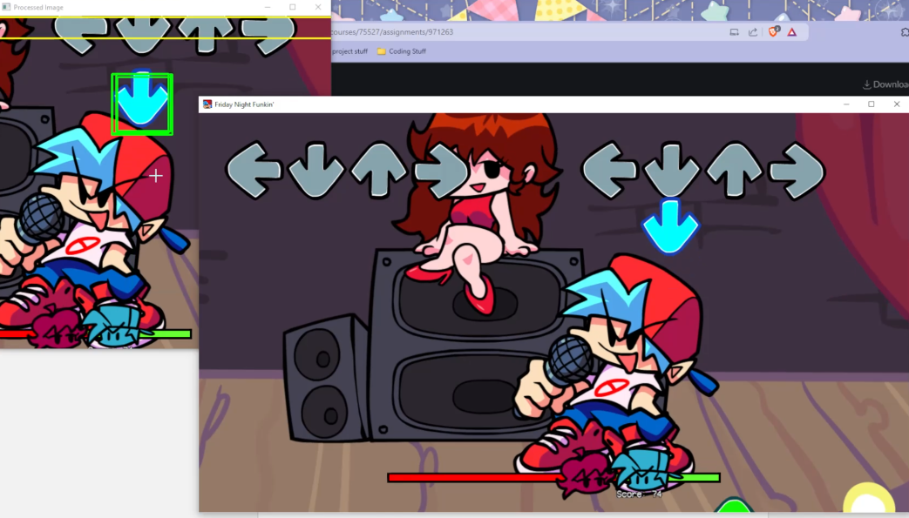

# FNF-AI-Reflex-Agent

### Hello Everyone! My name is Marcus and this is my FNF Reflex AI.

## Project Description
### This is a simple reflex agent that I made using the AI Theory I learned in my AI Theory class. It plays the rhythm game Friday Night Funkin and usually has around a 70% accuracy rate.

## Technologies Used
* ### Python: Simple language with a lot of AI Tools that are easily integratable.
* ### MSS: Fast screen capturing to capture a specific region of the screen.
* ### OpenCV & Numpy: Real time image processing.
* ### PyAutoGUI: Simulating keyboard inputs.